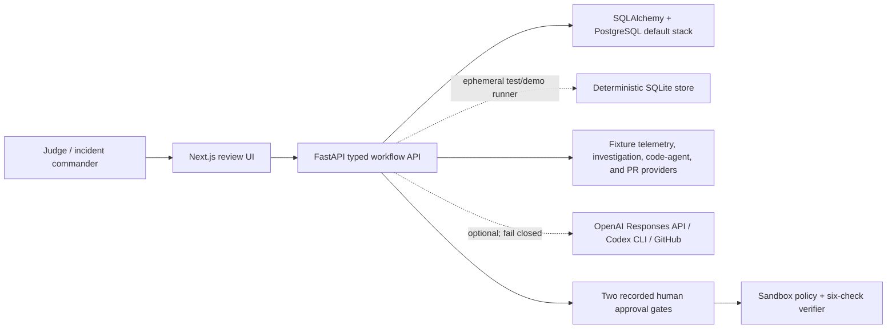

# Incident Commander AI

AI incident commander for small engineering teams: evidence-grounded diagnosis, human-approved remediation, verified patches. Blueprint: `docs/AI_INCIDENT_COMMANDER_MASTER_BLUEPRINT_v1.md`.

Built side-by-side with Codex for OpenAI Build Week. The optional live investigation adapter targets GPT-5.6 through the Responses API when explicitly configured; the reproducible judging demo remains credential-free and clearly labelled simulated.

**Status: M0-M9 locally complete; external submission in progress.** The deterministic demo completes the two-approval workflow through an explicitly simulated draft-PR package, communications, and an evidence-linked postmortem. No external credentials are required; remaining publication and submission steps are tracked in `docs/project/taskstatus.md`.

## Layout

| Path | What |
|---|---|
| `services/api` | Python 3.12 FastAPI backend (Pydantic v2, strict mypy, ruff, pytest) |
| `apps/web` | Next.js 15 App Router frontend (strict TypeScript, Vitest) |
| `packages/contracts` | Shared TypeScript contract types mirroring the backend Pydantic models |
| `docs/adr` | Architecture decisions, including the local-demo runtime boundary |
| `docs/architecture` | System context, state machine, security model, demo architecture |
| `LICENSE` | MIT license for public review and reuse |

## Quick start

Docker (one command):

```bash
make docker-up        # or: docker compose up -d --build
# web: http://localhost:3000   api: http://localhost:8000/docs
```

Native:

```bash
make setup            # pnpm install + backend venv (Python 3.12) + dev deps
make dev-api          # FastAPI on :8000
make dev-web          # Next.js on :3000 (second terminal)
```

`make bootstrap` is an alias for the fresh-clone setup contract. `make dev` runs the Docker development stack in the foreground.

Windows or any host without GNU Make can use the underlying commands directly:

```powershell
pnpm install --frozen-lockfile
uv sync --project services/api --extra dev
uv run --project services/api python -m uvicorn app.main:app --app-dir services/api --reload --port 8000
# second terminal
pnpm --filter @incident-commander/web dev
```

## Quality gates

```bash
make lint             # ruff + next lint + tsc
make typecheck        # mypy --strict + tsc --noEmit
make test             # backend, shared-contract, and web tests
make eval             # eight deterministic safety scenarios
make secret-scan      # Gitleaks over current tree and Git history
make demo-assert      # five complete deterministic demo runs
make openai-smoke     # optional credentialed GPT-5.6 structured-output proof
```

CI (`.github/workflows/ci.yml`) enforces backend/frontend gates, the web build, five deterministic demos, secret and dependency scans, and release-image builds on every push/PR to `main`.

## Golden demo (no credentials)

```bash
make demo-reset       # verify protected reset and RECEIVED seed state
make demo-run         # one full run through RESOLUTION_DRAFTED
make demo-assert      # five consecutive asserted runs
```

On Windows hosts without GNU Make, run the underlying command directly:

```powershell
uv run --directory services/api python -m app.demo.runner --runs 5
```

Every run uses an ephemeral SQLite database, fixture investigation, and the fixture code-agent. It exercises both public approval endpoints and asserts `RESOLUTION_DRAFTED`, simulated provider provenance, communications, and the evidence-linked postmortem. It never contacts OpenAI or GitHub.

See `docs/architecture/demo-architecture.md` for the full walkthrough.

## Architecture at a glance



The verified submission path is local and simulated where labelled. The default Compose stack uses PostgreSQL and Redis; the repeatability runner uses ephemeral SQLite. See [ADR 009](docs/adr/009-local-demo-runtime-boundary.md) for the remaining hosted-production boundary.

## Verified baseline

- Backend: Ruff and strict mypy pass across 56 application source files; 185 tests pass.
- Frontend: lint, strict typecheck, 20 web tests, 6 shared-contract tests, and production build pass.
- Browser: 22 Chromium scenarios pass, including four-viewport overflow checks, internal-link validation, and a real local-API flow through both approvals.
- Evaluations: all 8 deterministic safety scenarios and 13 grader/mutation tests pass.
- Optional live integrations fail closed and never replace deterministic demo mode. A bounded credentialed GPT-5.6 structured-output receipt is documented separately and is never implied by fixture artifacts.

See [task status](docs/project/taskstatus.md), [evidence checklist](docs/submission/evidence-checklist.md), [GPT-5.6 receipt](docs/submission/openai-live-smoke.md), and [demo script](docs/submission/demo-script.md) for current proof and remaining limitations.

## Principles

- Evidence passes a redaction boundary before persistence — raw payloads never do.
- Workflow state changes only through the deterministic state machine; model output is a typed proposal.
- External effects (patches, PRs) require recorded human approval.
- Simulated data is always labelled simulated.
