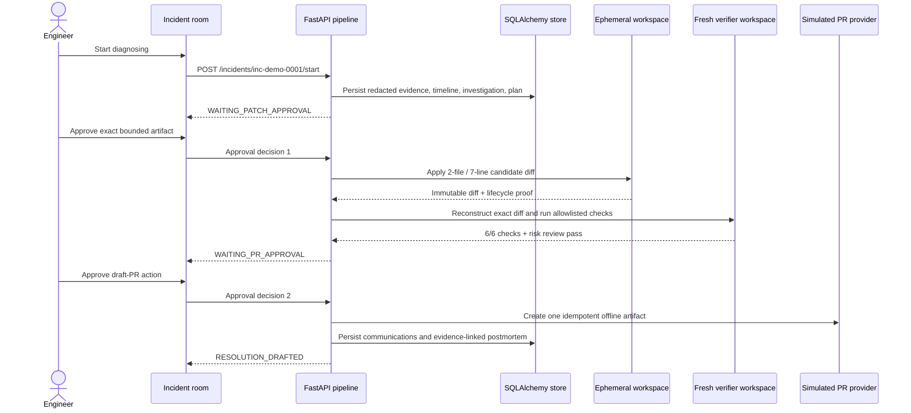

# Deterministic Demo Architecture

The golden demo is credential-free, reproducible, and explicitly simulated.
Blueprint sources: sections 23.4, 26.2, 32–33.

## Golden incident

`inc-demo-0001` models a checkout regression introduced by commit `c7f2e9a`:
sessions without a discount dereference `session.discount.code` and return HTTP
500 after deployment `2026.07.13.4`.

## Complete workflow



The visible result includes ranked cited hypotheses, the bounded remediation
artifact, exact diff, targeted/full test, lint, typecheck, regression and risk
checks, two approval records, simulated draft-PR artifact, communications, and
a postmortem containing 28 timeline events.

## Determinism and safety

- `make demo-reset`, `make demo-run`, and `make demo-assert` use ephemeral
  SQLite databases and never contact OpenAI or GitHub.
- The source fixture is checksum-verified before and after patching.
- Patch and verification workspaces are destroyed on success and failure.
- Verification commands map to fixed argv in
  `services/api/fixtures/checkout-api/verification_manifest.json`; repository
  text cannot introduce a new command or shell syntax.
- Five consecutive complete runs must reach `RESOLUTION_DRAFTED` with two
  approvals and the same expected artifacts.

## Run it

```bash
docker compose up -d --build
# web: http://localhost:3000
# api: http://localhost:8000/docs
```

See `docs/testing/m9-five-run-reliability.md` and
`docs/testing/m9-docker-compose.md` for retained verification evidence.
