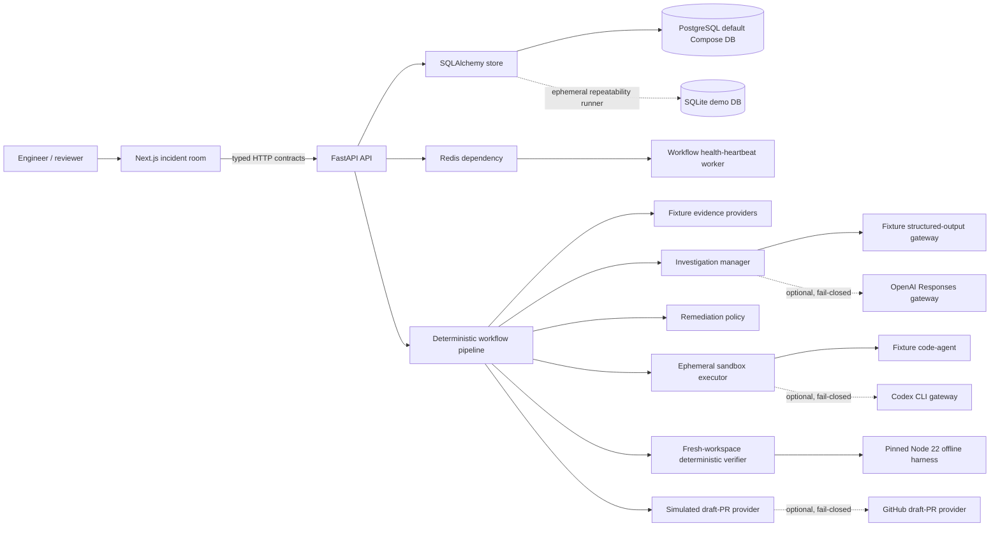

# System Context

Current integrated architecture for the deterministic M9 submission build.

## Runtime truth

- Demo mode is the default and requires no external credentials.
- The default Compose stack uses PostgreSQL 16 and Redis 7. Alembic applies all
  migrations before API startup, and dependency health probes verify both services.
- Tests and five-run demo assertions use fresh ephemeral SQLite databases for
  deterministic isolation; the cross-dialect models and migrations are exercised
  separately against PostgreSQL in the Compose smoke.
- Workflow execution remains synchronous inside the API process. The worker
  publishes Redis-backed health heartbeats but does not yet dequeue workflow jobs;
  a durable idempotent job consumer remains a production-hardening boundary.
- Fixture evidence, investigation, code-agent, and draft-PR artifacts are
  visibly labelled simulated.
- OpenAI Responses, Codex CLI, and GitHub adapters are explicit optional
  boundaries. Missing configuration fails closed; mock tests do not constitute
  credentialed live proof.

## Source map

| Area | Source |
|---|---|
| Web UI and typed client | `apps/web/app`, `apps/web/lib/api.ts` |
| API wiring | `services/api/app/main.py` |
| Durable state and artifacts | `services/api/app/store/sql.py` |
| Runtime dependencies and worker health | `services/api/app/runtime.py`, `services/api/app/worker.py` |
| State authority | `services/api/app/workflow/state_machine.py` |
| Orchestration | `services/api/app/workflow/pipeline.py` |
| Provider boundaries | `services/api/app/providers` |
| Sandbox and verification | `services/api/app/sandbox` |
| Shared frontend contracts | `packages/contracts/src` |
