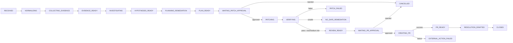

# Workflow State Machine

Implementation: `services/api/app/workflow/state_machine.py`. TypeScript mirror:
`packages/contracts/src/index.ts`. Only the pipeline advances state; provider
and model outputs are typed proposals.

Every transition appends a monotonic workflow event. Approval decisions are
single-use, expiry-checked, role-checked, and bound to artifact version/hash.
Terminal states have no outgoing transitions; recoverable failure states remain
explicit rather than being reported as success.

Parity and policy evidence:

- `services/api/tests/test_state_machine.py`
- `packages/contracts/src/state-machine.test.ts`
- `services/api/tests/test_remediation.py`
- `services/api/tests/test_verification.py`
- `services/api/tests/test_m7_pr_communications.py`
